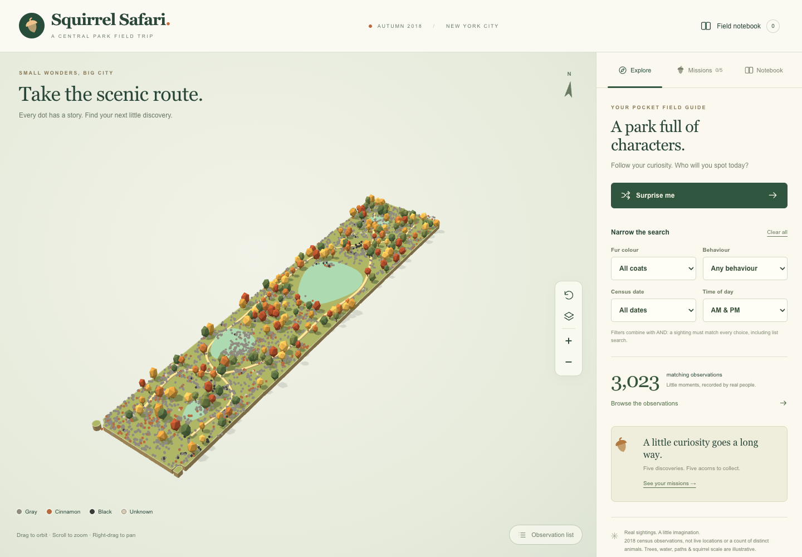

# Squirrel Safari

A standalone autumn diorama of the **2018 Central Park Squirrel Census**. Explore real sighting locations, open field notes, filter the census, collect five discovery acorns and keep a local notebook. A searchable, paginated index provides the same observations without WebGL.

Built with Vite, strict TypeScript, Three.js and native HTML controls. No React, backend, account, analytics or external runtime API. Nothing has been deployed.



## Run locally

Requires **Node.js 22.12+**, npm and a modern browser. From this directory:

```sh
npm ci
npm run dev
```

Open **http://127.0.0.1:5173/**. Mouse: drag to orbit, right-drag to pan, scroll to zoom. Touch: one finger to orbit; two fingers to pan/pinch. Camera buttons and the observation index provide keyboard alternatives.

```sh
npm run typecheck
npm test
npm run build
npm run preview
```

Preview opens at **http://127.0.0.1:4173/**. Builds and ordinary browsing use the bundled snapshots, with no census API request. Install dependencies once before offline development; this is not an offline service-worker app.

## Refresh the bundled data

```sh
npm run data:refresh
npm run data:park
npm test
npm run build
```

The scripts require `curl` and internet access; curl honours your shell's standard proxy variables. They write temporary files and replace each snapshot only after validation. Review and commit changed snapshots and metadata together.

`data:refresh` requests explicit **1,000-row pages**, ordered by `unique_squirrel_id ASC, :id ASC`, until the last page, then independently checks the API's count. If pagination or the count check fails, it tries NYC's official full `rows.json` export and maps its column metadata. Neither path fabricates observations. An approximately 3,023-row sanity check warns about source changes without hardcoding the application total. Empty exports and missing IDs fail without overwriting the existing snapshot.

`data:park` selects NYC Parks property **M010** from Functional Parkland, with explicit ordering and a 100-row limit for this single property. It preserves all returned polygon coordinates and holes.

## Provenance and transformations

| Asset                     | Source                                                                                                                                                                                                                                            | Snapshot                                                           |
| ------------------------- | ------------------------------------------------------------------------------------------------------------------------------------------------------------------------------------------------------------------------------------------------- | ------------------------------------------------------------------ |
| `public/data/census.json` | [2018 Central Park Squirrel Census — The Squirrel Census / NYC Open Data](https://data.cityofnewyork.us/Environment/2018-Central-Park-Squirrel-Census-Squirrel-Data/vfnx-vebw); [JSON API](https://data.cityofnewyork.us/resource/vfnx-vebw.json) | Retrieved **2026-09-11**, 3,023 records, zero rejected coordinates |
| `public/data/park.json`   | [Functional Parkland — NYC Department of Parks & Recreation / NYC Open Data](https://data.cityofnewyork.us/Recreation/Functional-Parkland/xhvt-s4va)                                                                                              | Retrieved **2026-09-11**, three polygons for Central Park          |

The snapshots also contain precise UTC retrieval timestamps, source URLs and transformation metadata. Source attribution is visible in the interface. The current park boundary is a geographic reference, not a reconstruction of its exact 2018 extent.

- Preserve original observation ID as `observationId`. Five records repeat an earlier source ID; all are retained. Internal `id` keys use `~2` suffixes in the stable source order where needed, for unambiguous selection, notebook entries and links. Displayed IDs remain the originals. A future source revision that reorders duplicate records may affect suffix links; retain a snapshot if long-term immutable links are needed.
- Parse actual eight-character **MMDDYYYY** dates to validated ISO dates. Invalid or absent dates become `null`; display uses UTC to avoid shifting the calendar day.
- Convert booleans and `"TRUE"`/`"FALSE"` strings to `true`/`false`; missing or unrecognised values remain `null`. **No** and **Unknown** remain distinct in each field card's full flag list.
- Preserve primary/highlight coat colours, age, location, shifts, all five activity flags, three human-reaction flags, three vocalisation flags and two tail flags.
- Preserve `specific_location`, `other_activities`, `other_interactions`, `color_notes` and the combined coat description. The normaliser also accepts `other_comments` if present in a future export. Source text is trimmed and rendered using `textContent`, never interpolated into HTML.
- Preserve raw `above_ground_sighter`; parse only nonnegative numeric text as height. The API metadata does not specify a measurement unit, so the interface displays the source number with ‘units unspecified’ rather than assuming feet or metres. `FALSE`, blanks and ambiguous values remain unknown height rather than being interpreted as zero. Heights do **not** control model elevation; all sighting markers use a flat common plane.
- Reject non-finite, missing, swapped or out-of-NYC coordinates (longitude −74.1…−73.8; latitude 40.6…40.95), reporting the count. This is deliberately broader than the park boundary so park-edge records are not silently dropped. Keep valid original longitude and latitude without snapping to paths or trees.

## Geography and visual limitations

`src/data/geo.ts` projects WGS84 longitude/latitude into local metric east/north coordinates around **40.7829° N, 73.9654° W**, using the ellipsoid's local east and north radii of curvature. A 29° rotation aligns the long park axis; **one scene unit equals ten metres**, uniformly in both horizontal directions. This short-range tangent-plane approximation is suitable for the park's roughly four-kilometre length, not citywide surveying. Both the official park boundary and sightings use exactly the same projection. The compass follows the camera.

**Trees, paths, water shapes, model sizes and acorns are illustrative.** They are not surveyed features and may overlap real sightings. The model's acorn and pose are visual motifs, not a claim about an observation's behaviour. Above-ground observations are not reconstructed in 3D. Lighting suggests autumn; it does not reconstruct time of day. These are historical **sightings**, potentially of the same animal, not live positions, movement tracks or a precise population count.

At wide zoom, every matching record has an instanced colour marker. Dense/overlapping markers can obscure one another; use filtering, zoom or the complete index to resolve them. Close views show at most 28 nearby shared squirrel models (12 on mobile), plus a highlighted selected squirrel. The selected sighting remains visible even when it falls outside current filters, with an explicit card notice. A separate portrait renderer runs only when its card needs rendering.

## Architecture and lifecycle

- `scripts/refresh-data.ts`, `scripts/refresh-park.ts`: reproducible source acquisition; no build hooks or runtime downloads.
- `src/data/types.ts`, `normalize.ts`, `geo.ts`: schema, pure transformations and projection.
- `src/state.ts`: AND filters, selection, random matching selection, mission rules and versioned defensive local storage.
- `src/ui.ts`: static interface template and safe text-based record rendering.
- `src/app.ts`: exported mount/cleanup, loading and fallback states, state-to-interface wiring, deep links and clipboard handling.
- `src/scene/scene.ts`, `squirrel.ts`: lazy-loaded Three.js scene, shared procedural resources, instancing, raycasting, camera and portrait.
- `src/styles.css`: experience styles; `src/standalone.css`: standalone page reset.

The scene caps pixel ratio (2 desktop / 1.5 mobile), reduces mobile decorations, renders on demand, pauses when hidden/offscreen, and limits animation to camera transitions. Reduced-motion preferences skip transitions. Cleanup aborts fetches and DOM listeners, removes camera/media/visibility listeners, disconnects resize/intersection observers, cancels frame callbacks and timers, and disposes controls, instances, geometry, materials, shadow maps and both WebGL renderers/contexts.

Discoveries use `squirrel-safari:discoveries:v1` in localStorage. Corrupt/version-mismatched data, stale IDs, security exceptions and quota failures are handled defensively. Reset clears only this experience's discoveries. Progress is not synced between devices or live between open tabs. A deep link uses `?squirrel=<internal-id>` and preserves unrelated URL parameters.

## `/squirrels/` base path

The default Vite base is `./`, so the distribution uses relative assets. For an explicit site subdirectory:

```sh
BASE_PATH=/squirrels/ npm run build
BASE_PATH=/squirrels/ npm run preview
```

Open **http://127.0.0.1:4173/squirrels/**. Serve the output directory at `/squirrels/` with its trailing slash; query-string sighting links require no special rewrite routes. No deployment infrastructure is included.

## Browser checks

```sh
npx playwright install chromium
# Start npm run dev in another terminal, then:
npm run test:browser
```

The suite uses an isolated Chromium profile and software WebGL, not your regular browser profile. It covers desktop/mobile layout, selection, filtering, clipboard/deep links, all five missions, local persistence/reset, keyboard index access, pagination, reduced motion, failed-data retry and forced WebGL/storage/clipboard failures. Screenshots are written to `artifacts/`.

The Three.js scene is a lazy chunk of about 570 kB (148 kB gzip); Vite reports its standard 500 kB advisory. The accessible interface loads separately. Real-device Safari/iOS and assistive-technology testing are still recommended before moving this prototype into the main site.

## Validation record

Validated locally on 2026-09-11: strict TypeScript checking, eight data/state tests, ten Chromium browser scenarios, and a separate production smoke test at `/squirrels/`. Normal scene and deep-link checks reported no browser errors or missing assets. Forced-failure scenarios intentionally produce diagnostic warnings. Desktop (1440×1000), mobile (390×844), and narrow mobile (320×640) were exercised; screenshots are in `artifacts/`. Mount/remount testing checks that canvases, observed targets and scheduled frames are released.
